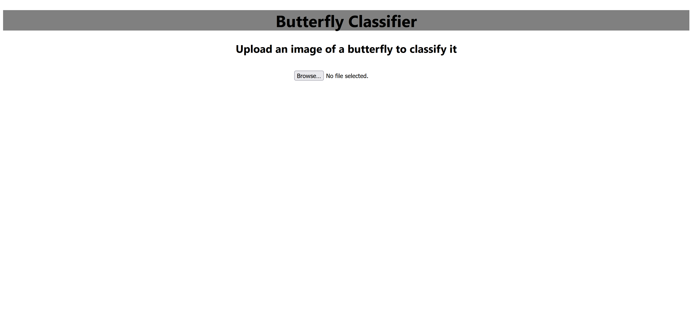
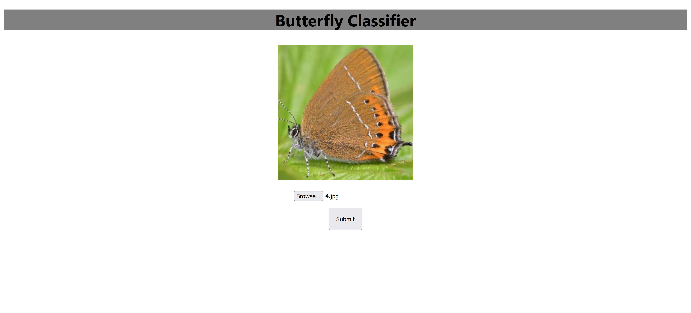
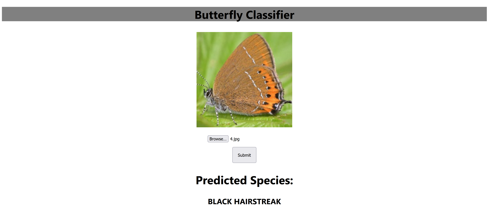

# Butterfly Classifier
This project creates a webpage using FastAPI and React that is capable of classifying an uploaded image of a butterfly as one of the 75 species in a Butterfly Image Classification dataset found on Kaggle. The classification is done by a MobileNetV3 model pretrained on ImageNet and built in TensorFlow. The focus of the project was on building software engineering skills such as attaching the model to a web app, using black, isort, and flake8 for code formatting, and making it easy to deploy by packaging the requirements together in Docker Compose.

### Project Structure
```bash
├───backend
│   ├───app
│   └───model
├───data    
├───frontend
│   ├───build
│   ├───node_modules
│   ├───public
│   └───src
│       └───components
└───images
```
The backend directory contains the files for the TensorFlow model in its model directory and the files for the backend of the webpage created with FastAPI in its app directory. The data directory is a placeholder directory that is missing in the repo but denotes where the data should be downloaded to. The frontend directory contains the frontend of the webpage, created with React. The directories build, node_modules, and public were autogenerated and contain no code that needs to be modified. The src directory is where the actual code is to define the frontend. Its component subdirectory contains the specifics for the layout of the frontend and how it should interact with the backend. Lastly, the images directory contains pictures of the webpage shown in this README.

### Getting Started
If you are interested in just running the webpage, you may skip ahead to [Building the Webpage](#building-the-webpage). The first two sections here are for those who are interested in the dataset and training the machine learning model themselves.

##### Download Data
The dataset used to train the model can be downloaded from [here](https://www.kaggle.com/gpiosenka/butterfly-images40-species). It should be extracted into the data folder. The following variables in `model.py` are dependent on the location of the data, so they may need to be changed if your directory structure is different: 
```python
train_data_dir = pathlib.Path("../../data/train")
val_data_dir = pathlib.Path("../../data/valid")
```

##### Training the Model
To train the model, the `requirements.txt` file in the backend directory can be used to create an environment with all the dependencies required. Please note that this does not include all the cuda files necessary to train with a GPU. In order to use a GPU, see the TensorFlow documentation [here](https://www.tensorflow.org/install/gpu). Once everything is installed, the model can be trained by running `python model.py` from the model directory. This will save the trained model in the path `./backend/model/training_1/`.

##### Building the Webpage
From the home directory of the project, run `docker compose up --build -d` to build the docker containers for the backend and frontend. Once the containers are built, navigate to `http://localhost:3000` in order to view the webpage. If it loads correctly, you should see the following screen:
 <br/>
After selecting a photo of a butterfly from your device, the screen will look like this:
 <br/>
Next, the "submit" button should be clicked to classify the butterfly with the model:
 <br/>
That's it! Hope you enjoy this project.